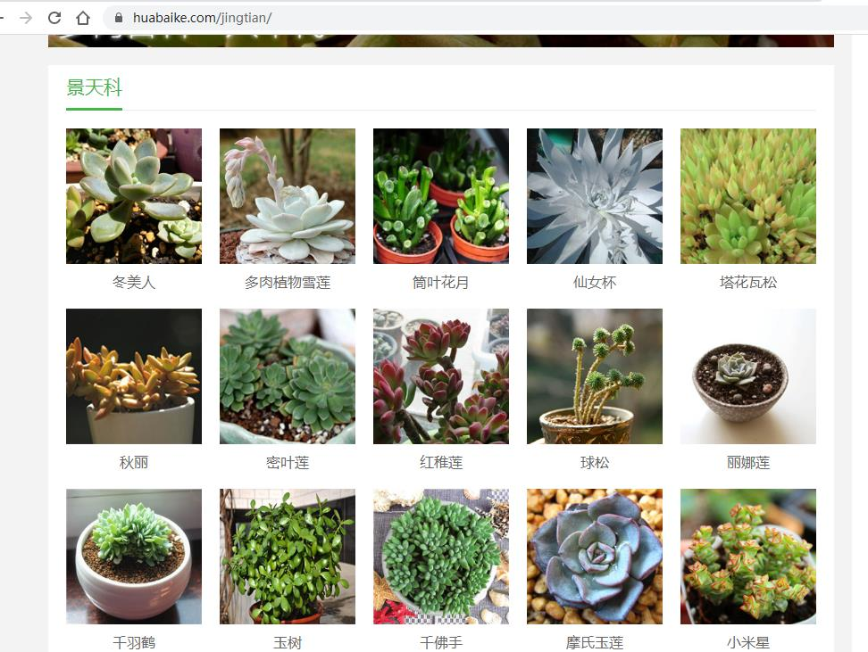
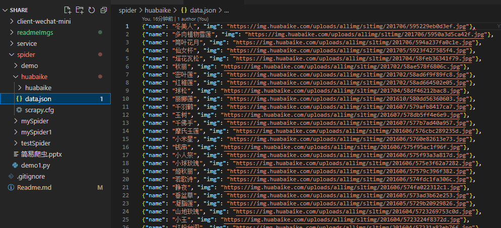
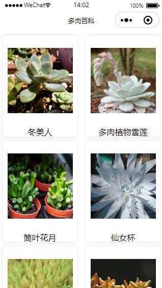

## 项目应用流程

>1. 用python的scrapy框架从花百科网站爬取数据
>2. 将爬取的数据存入MongoDB数据库
>3. 用express框架生成服务端项目并启动，并创建一个从数据库中获取爬取数据的接口
>4. 创建一个微信小程序应用，请求服务端接口

## 项目文件夹说明
> + client-wechat-mini： 微信小程序项目源码
> + service：服务端项目源码
> + spider： scrapy爬虫项目源码
> + mongoDB: mongoDB数据库说明

## Demo实战图示

> + 爬取数据的原网站
[花百科网站-景天科](https://www.huabaike.com/jingtian/)

> + 爬出的JSON数据

> + 爬出的数据在客户端的应用

